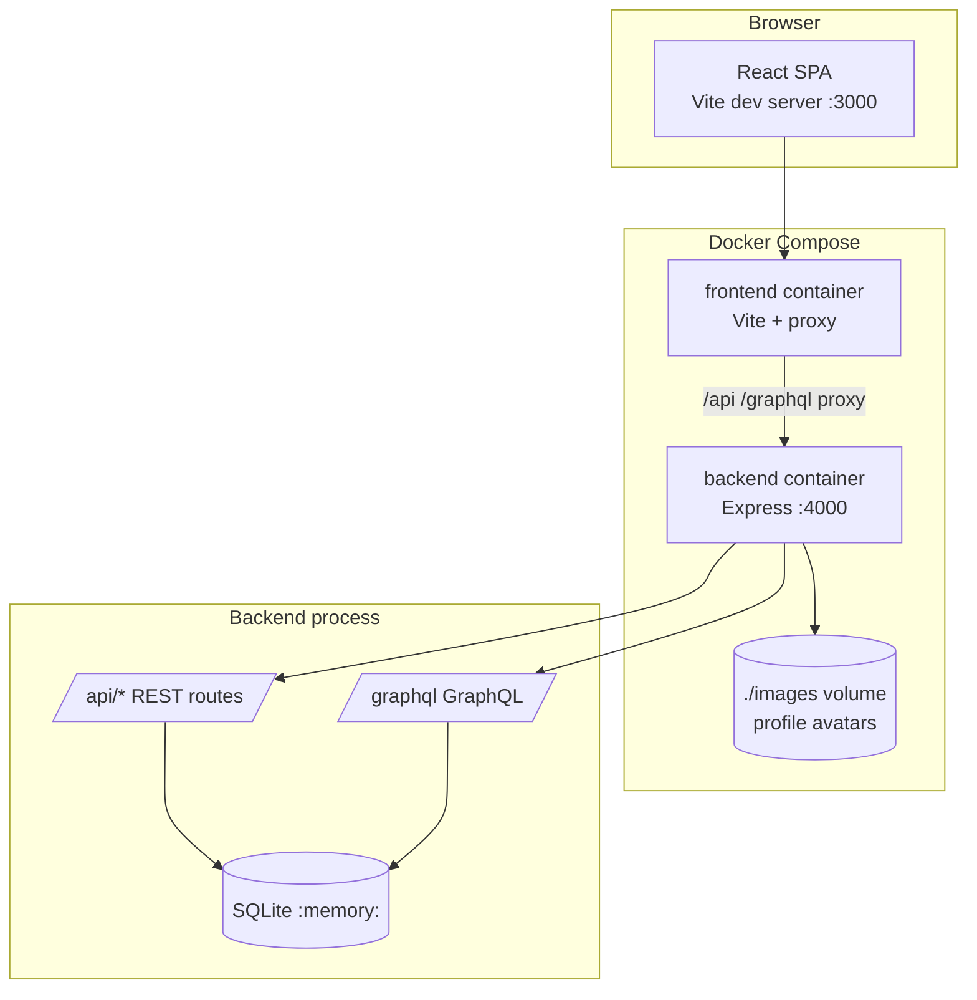

# Architecture — Potion Brewery (Node.js stack)

This document describes how **The Bubbling Cauldron** is structured: components, APIs, data, deployment, and the main request flows (including the bug fixes).

Related docs:

- [README.md](./README.md) — challenge tasks and local setup
- [BUGFIXES.md](./BUGFIXES.md) — bugs fixed, verification, CI pipeline

---

## System overview

The app is a single-page React UI backed by an Express server. Profiles use **REST**; potion orders use **GraphQL**. Data lives in an in-memory **SQLite** database seeded on startup.



---

## Layer summary

| Layer | Technology | Responsibility |
|-------|------------|----------------|
| **UI** | React 18, TypeScript, CSS modules | Login, profile, kanban board, modals |
| **Dev server** | Vite 8 | HMR, proxies `/api` and `/graphql` to backend |
| **API — profiles** | Express REST | Alchemist CRUD, image payloads as base64 |
| **API — orders** | GraphQL (`graphql` JS) | Query/filter orders; mutate status & assignment |
| **Data** | `node:sqlite` in-memory | `alchemist_profiles`, `potion_orders` tables |
| **Assets** | Filesystem `./images` | Default avatar PNGs loaded at seed time |

---

## Frontend components

| Component | Role |
|-----------|------|
| `AlchemistLogin` | Name combobox; creates or selects alchemist |
| `AlchemistProfile` | View/edit profile, service date, photo |
| `PotionBoard` | Kanban columns, drag-and-drop, polling, reassign |
| `CreatePotionModal` / `ReassignModal` | Order create & alchemist reassignment |

Shared utilities:

| Module | Role |
|--------|------|
| `utils/validation.ts` | Service date + drag-drop helpers (unit tested) |
| `utils/graphql.ts` | GraphQL POST helper |
| `utils/helpers.ts` | Dates, initials, years of service |

---

## Backend modules

| Module | Role |
|--------|------|
| `src/index.ts` | Express app, CORS, mounts routes, starts server |
| `src/api/alchemists.ts` | REST routes under `/api` |
| `src/api/potions.ts` | GraphQL schema + resolvers |
| `src/database/init.ts` | Schema creation, sample seed data |
| `src/utils/validation.ts` | Server-side date validation |

---

## API surface

### REST — profiles (`/api`)

| Method | Path | Purpose |
|--------|------|---------|
| `GET` | `/api/alchemists` | List names (+ thumbnails) |
| `GET` | `/api/alchemist/:name` | Full profile + `potions_completed` count |
| `POST` | `/api/alchemist` | Create alchemist |
| `PUT` | `/api/alchemist/:name` | Update date and/or profile image |

### GraphQL — orders (`/graphql`)

| Operation | Name | Purpose |
|-----------|------|---------|
| Query | `potionOrders(filter)` | List/filter by status or alchemist |
| Query | `potionOrder(id)` | Single order |
| Mutation | `addPotionOrder` | Create order (status `To Do`) |
| Mutation | `updatePotionOrderStatus` | Move kanban column (**Bug 2a** fix) |
| Mutation | `updatePotionOrderAlchemist` | Reassign order |

Valid statuses: `To Do`, `Brewing`, `Quality Control`, `Ready for Pickup`.

### Health

| Method | Path | Purpose |
|--------|------|---------|
| `GET` | `/health` | Liveness check (Docker + CI) |

---

## Key request flows

### 1. Login

1. Browser loads React app from Vite (`localhost:3000`).
2. `AlchemistLogin` fetches `GET /api/alchemists`.
3. User selects or creates a name → `POST /api/alchemist` if new.
4. `App` stores `loggedInAlchemist` in React state (no server session).

### 2. Edit profile (Bug 1)

1. User opens edit form → `GET /api/alchemist/:name`.
2. On save, **client** runs `validateServiceStartDate()` (`frontend/src/utils/validation.ts`).
3. **Server** re-validates on `PUT /api/alchemist/:name` (`backend/src/utils/validation.ts`).
4. Future dates → `400` with error message; past/today → SQLite update.

### 3. Drag potion between columns (Bug 2)

1. `PotionBoard` loads orders via GraphQL `potionOrders` query (polls every 3s).
2. User drags a card → `dragstart` stores order id in `dataTransfer`.
3. Drop on column **or card** → `handleDrop` (**Bug 2b** — cards must handle drop).
4. `updatePotionOrderStatus` mutation → backend runs `UPDATE` (**Bug 2a**).
5. Board refetches orders.

### 4. Docker / CI path

1. `docker compose up` builds `demo-backend` and `demo-frontend`.
2. Frontend proxy target: `API_PROXY_TARGET=http://backend:4000`.
3. Backend mounts `./images` → `/images` for avatar seed files.
4. CI runs build, tests, Trivy; PRs get an automated results comment.

---

## Docker Compose topology

| Service | Image base | Port | Notes |
|---------|------------|------|-------|
| `backend` | `node:24-bookworm-slim` | 4000 | Compiles TS, runs `node dist/index.js` |
| `frontend` | `node:24-bookworm-slim` | 3000 | Vite dev server, `--host 0.0.0.0` |

`node:24-alpine` was avoided due to `exec format error` on some Docker Desktop hosts.

---

## Design note — Undo feature (Task 3, not implemented)

The README asks for undo with preview and conflict handling. A minimal slice could look like:

| Decision | Proposed approach |
|----------|-------------------|
| **Scope** | Undo last **status change** and **reassignment** only (not create/delete) |
| **Storage** | Client-side stack per session (no new tables for a first slice) |
| **Preview** | Modal: “Move *Dragonfire* from Brewing → Quality Control?” |
| **Conflict** | Compare current server status to pre-action snapshot; if poll changed it, show merge/cancel |
| **API** | Re-use existing mutations; undo = inverse mutation |

Full multi-level undo with server audit log would be the “ideal” direction for a longer iteration.

---

## Verification & CI

See [BUGFIXES.md](./BUGFIXES.md) for test suites, Trivy scanning, and the GitHub Actions pipeline that posts results on pull requests.

```bash
npm run ci          # local pipeline (build + 23 tests)
docker compose up   # run stack
```
